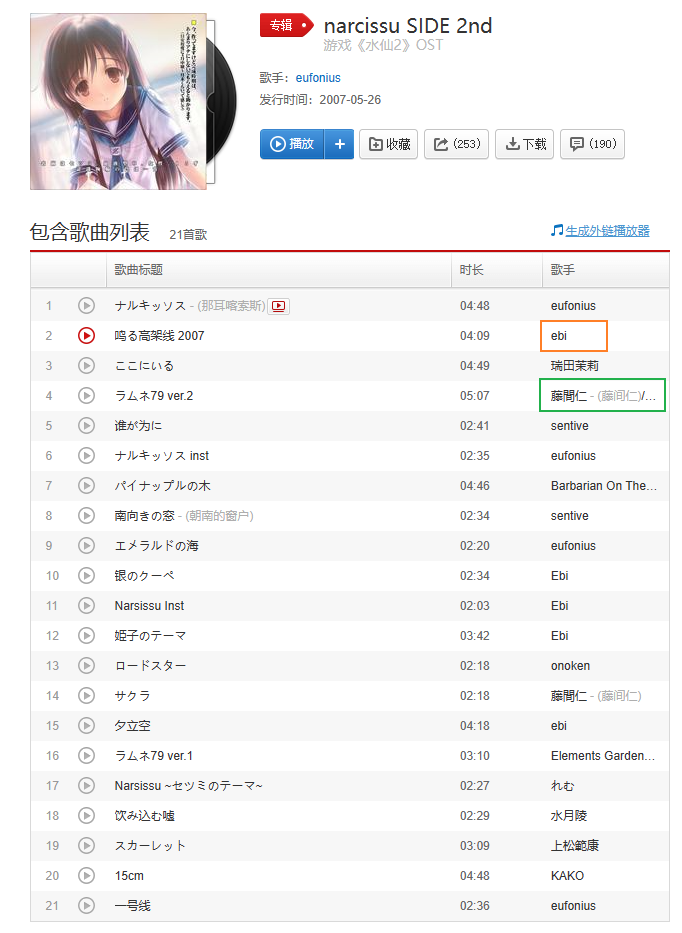
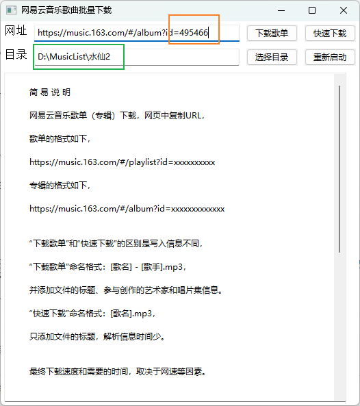
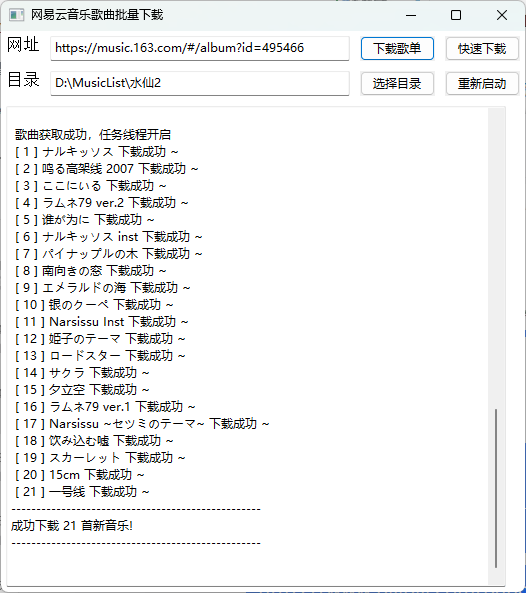
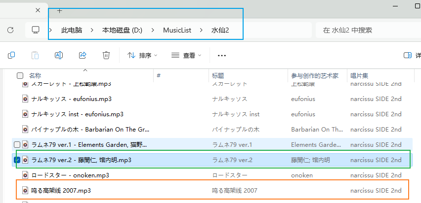

# 使用说明

下载本项目后，安装Python依赖后，

- 直接运行`main.py`，或者
- 使用`build.bat`打包源代码成可执行文件，再运行dist目录下的`163musicdownload.exe`。

## 菜单说明

- 下载歌单：会下载歌曲的**歌名、歌手和专辑信息**，需要去每个歌曲页面读取歌手、专辑信息。
- 快速下载：只在歌单页面读取**歌名**信息。
- 选择目录：设置目录，也可以自己写入目录路径，指定的目录不存在时会自动创建。
- 重新启动：每次下完歌单需要重启程序才能再次下载新的歌单，也可以在下载的中途进行重启。

### 命名格式

- 下载歌单：[歌名] - [歌手].mp3
- 快速下载：[歌名].mp3

文件详细信息由抓取到的结果自动填入，详细见于[查看下载结果](#查看下载结果)中的效果。

## 下载示例

以[narcissu SIDE 2nd](https://music.163.com/#/album?id=495466)为例，案例中的歌单
的部分歌曲有多位演唱者（绿色方框），也有部分歌手没有信息页面（橙色方框）。



### 填写URL和下载目录

按照格式填写网页URL，最好直接复制粘贴，避免出错。

填写下载目录，也可以自己写入目录路径，支持中文目录。

指定的目录不存在时会自动创建，这里为了演示，
设置与默认路径（D:\MusicBox）不同的路径（D:\MusicList\水仙2），之后点击下载歌单。



### 查看下载进度

一开始解析歌单信息可能会有些慢，
开始下载后会显示正在下载的歌曲，最后会统计成功下载、失败下载和跳过下载歌曲的数量。

歌曲下载失败可能是因为该歌曲是付费歌曲，或者歌曲没有版权，或者歌曲已经被删除等。



### 查看下载结果

如图，点击“下载歌单”后，在自动创建了新目录，并且在该目录下保存所有歌曲文件，填写文件详细信息。



## Python依赖

```cmd
pip install wxPython mutagen
```

其中，wxPython用于GUI，mutagen用于写入歌曲信息。

## 其他信息

- Windows 11 23H2
- Visual Studio Code 1.83.1
- Anaconda3 2023.09
- Python 3.11.5

## 参考项目

原始项目参考 [NetEaseCloudMusic-nonmembership-list-download](https://github.com/CcphAmy/NetEaseCloudMusic-nonmembership-list-download)，原始说明文档等信息移动到
[docs文件夹](./docs/)下。

## 免责声明

仅供学习交流，严禁用于商业用途。
